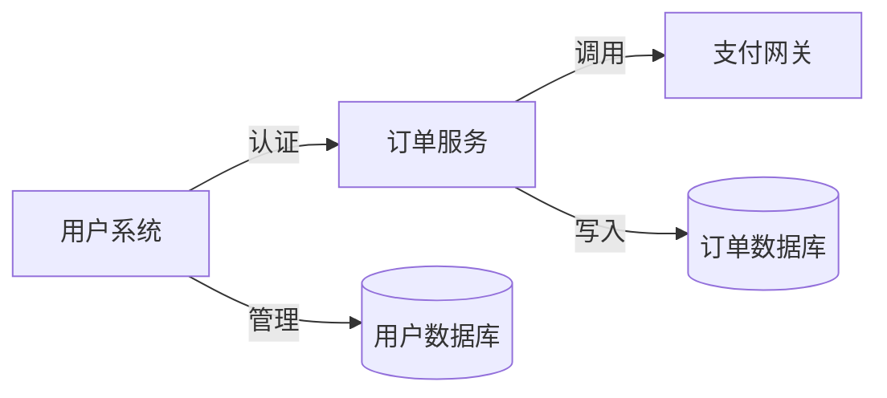

# 文档知识图谱挖掘技能 (doc_knowledge_graph)

## 技能描述

对飞书文档内容进行深度挖掘，自动识别实体、概念及其关系，生成结构化的知识图谱说明文档。

## 技能信息

```javascript
{
  id: 'doc_knowledge_graph',
  name: '文档知识图谱挖掘',
  description: '分析飞书文档内容，提取实体与关系，生成知识图谱说明文档',
  type: 'custom',
  enabled: true
}
```

## 输入

一个或多个飞书文档链接，例如：
- `https://bytedance.feishu.cn/docx/xxxxxxxx`
- `https://your-domain.feishu.cn/wiki/xxxxxxxx`

## 输出

Markdown 格式的知识图谱说明文档，包含以下内容：

### 1. 文档概览
- 文档主题与摘要
- 关键实体统计
- 关系网络概述

### 2. 实体列表
- 所有提取的实体（概念、人物、地点、组织等）
- 实体类型分类
- 实体描述与出现位置

### 3. 关系图谱
- 实体之间的关系描述
- 关系类型说明
- 关系强度标注

### 4. 可视化图谱
- Mermaid 关系图
- 核心实体网络
- 聚类分析结果

### 5. 洞察与建议
- 核心概念总结
- 知识关联发现
- 进一步挖掘建议

## 使用示例

### 示例 1: 单个文档挖掘
```
用户: 请挖掘这个飞书文档的知识图谱 https://bytedance.feishu.cn/docx/abc123
Agent: 好的，正在分析文档内容并生成知识图谱...
```

### 示例 2: 多个文档挖掘
```
用户: 请分析这几个文档并构建知识图谱：
1. https://bytedance.feishu.cn/docx/doc1
2. https://bytedance.feishu.cn/docx/doc2
Agent: 好的，正在跨文档分析并构建联合知识图谱...
```

## 执行步骤

```javascript
steps: [
  { type: 'thought', content: '用户需要对飞书文档进行知识图谱挖掘' },
  { type: 'thought', content: '解析文档链接，确认文档有效性' },
  { type: 'action', content: '调用飞书API获取文档内容' },
  { type: 'action', content: '执行实体识别与关系抽取' },
  { type: 'action', content: '构建知识图谱结构' },
  { type: 'action', content: '生成Markdown说明文档' },
  { type: 'observation', content: '知识图谱生成完成，包含 N 个实体和 M 个关系' }
]
```

## 技术实现要点

### 实体识别
- 命名实体识别 (NER)
- 术语提取
- 概念归一化
- 实体分类

### 关系抽取
- 依存句法分析
- 语义角色标注
- 关系类型分类
- 置信度评估

### 图谱构建
- 节点创建
- 边连接
- 属性映射
- 图谱验证

### 可视化
- 自动布局
- 层级结构
- 颜色编码
- 交互优化

## 输出格式示例

```markdown
# 文档知识图谱报告

## 📄 文档概览

**文档标题**: 产品架构设计文档
**分析时间**: 2026-03-10
**提取实体**: 15 个
**识别关系**: 22 条

---

## 📦 实体列表

### 核心概念
| 实体 | 类型 | 描述 |
|------|------|------|
| 用户系统 | 系统 | 负责用户认证与管理 |
| 订单服务 | 服务 | 处理订单生命周期 |
| 支付网关 | 组件 | 第三方支付集成 |

---

## 🔗 关系图谱

### 核心关系网络


---

## 💡 核心洞察

### 关键发现
1. **架构分层清晰**: 系统采用标准的三层架构
2. **服务解耦**: 各模块通过 API 通信，耦合度低
3. **数据一致性**: 订单与用户数据保持双向同步

### 建议
- 考虑添加订单缓存层提升性能
- 建议增加支付重试机制
```

## 依赖项

- 飞书开放平台 API
- NLP 实体识别模型
- 关系抽取算法
- Mermaid 图表生成

## 错误处理

| 错误情况 | 处理方式 |
|---------|---------|
| 文档链接无效 | 提示用户检查链接格式 |
| 无权限访问 | 提示用户确认文档权限 |
| 文档内容为空 | 提示文档内容不足 |
| 提取失败 | 降级到基础实体列表 |

## 性能指标

- 单文档处理: < 30 秒
- 多文档处理: < 2 分钟
- 实体准确率: > 85%
- 关系准确率: > 75%

---

*本技能遵循 Claude Code 技能开发规范*
